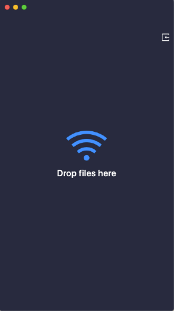
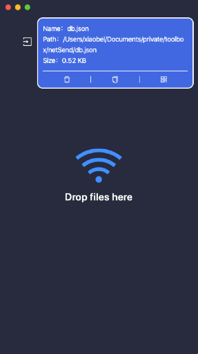

# NetSend

English | [简体中文](./README-CN.md)

An intranet file transfer tool based on umijs + electron + javascript

## Introduction




Support different systems to transfer files.
Transfer files between computers or mobile phones, no size limit.

## How to develop

### Project structure

```ssh
.
|-- build
|   |-- icon.icns                         // MacOS icon
|   |-- icon.ico                          // Windows icon
|   |-- webpack.base.config.js            // electron-webpack base config
|   |-- webpack.main.config.js            // electron-webpack dev config
|   `-- webpack.main.prod.config.js       // electron-webpack prod config
|-- dist                                  // build dist
|   |-- main                              // main dist
|   `-- renderer                          // render dist
|-- release                               // release folder
|-- src                                   // code folder
|   |-- main                              // main process code
|   |   -- main.js                        // main.js
|   |   -- koa.js                         // koa server
|   |   -- db.js                          // db
|   |   -- helper.js                      // public method
|   `-- renderer                          // umi code
|       |-- assets
|       |-- config
|       |   |-- config.js                 // umijs config
|       |-- pages
|           `-- index.js
|       |-- public
|           `-- renderer.js
|-- package.json
`-- README.md
```

#### Installation dependencies

```javascript
  $ yarn
```

#### Development

1. start the rendering process with the following command(default port：8000)

```javascript
  $ yarn start:renderer
```

2. start the main process

```javascript
  $ yarn start:main
```

#### build

```javascript
  $ npm run pack  // 打包macOS
  $ npm run exe   // 打包windows
```

If you want to package the code into a dmg file or zip file, you can execute the following command

```javascript
  $ npm run dist
```
